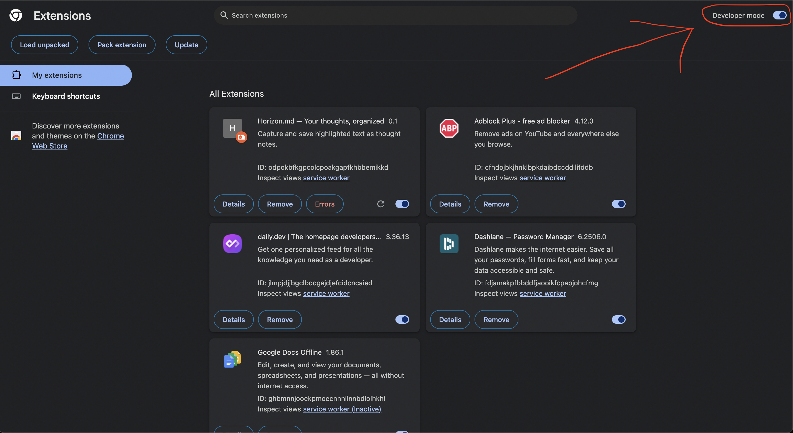
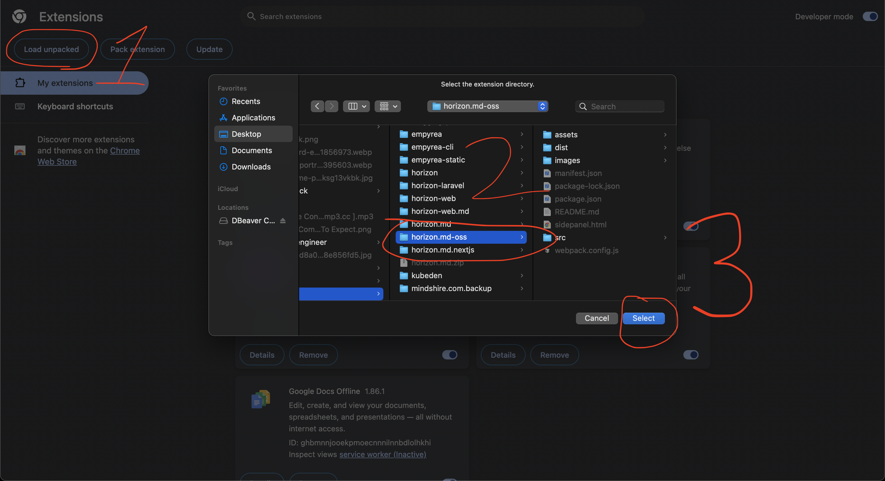
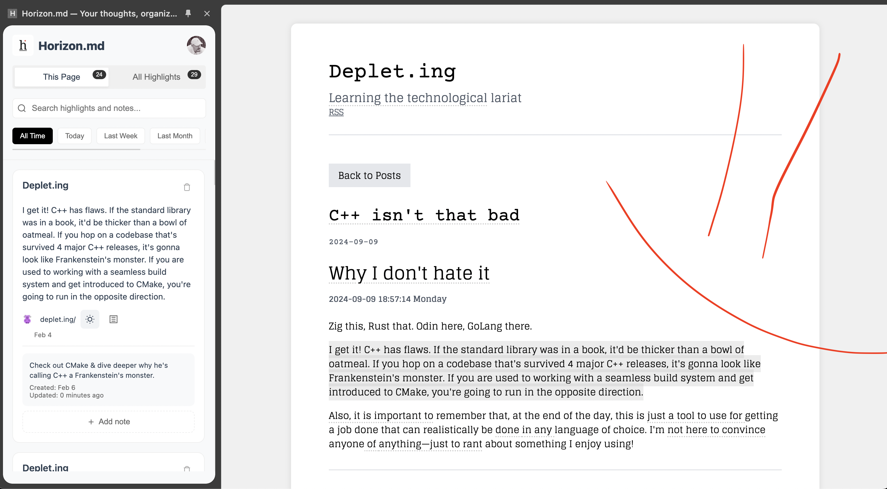

#  Horizon.md (Alpha)

Horizon.md is a browser extension and a web platform that lets you highlight and note any text or video on the internet.

## Alpha

This is the Alpha release of Horizon, pre-platform.

## Installation

Install the required libraries for webpack and build.

```
npm install
npm run build
```

I. Open Chrome -> Extensions -> Toggle `Developer Mode`:



II. Click `Load Unpacked` -> Select The Directory



III. Start Using

